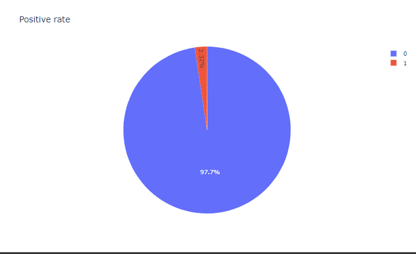
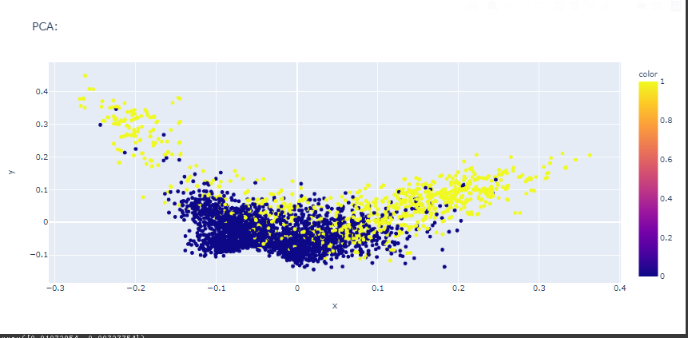

### 分析結果
+ 大多数でnegativeが占める
  
* ウイルスに関する語句が多い印象
  
*  最大のトークン数は`1620`  
* `NAN`データに多少ながらPositiveの割合が多い印象,つまりタイトルのみで判断されている。  

* TF-IDFによる次元削減、ある程度の削減量で分類面ができているように見える。結果として1000次元まで削減することで分散による説明力60%を超えた。  
